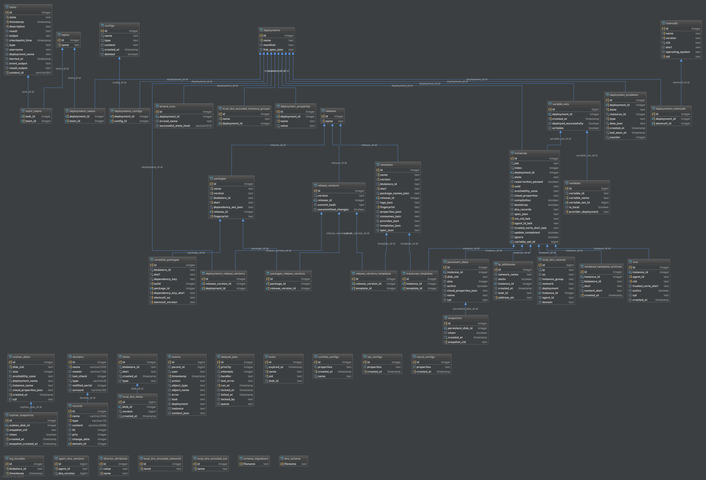

# BOSH Director Database Schema

Here is an ER diagram of the schema that the BOSH director uses for
storing its state. The schema is accessed through a Ruby ORM called
Sequel. The Ruby classes that this schema maps to are located in the
[director's Models module](../../bosh-director/lib/bosh/director/models).

**Warning: This diagram can become stale quickly; generate when necessary**
# TODO: IPv6 regenerate SVG & PNG images
The above PNG file was generated using RubyMine Database Plugin.
There's also a [searchable SVG version.](https://cdn.rawgit.com/cloudfoundry/bosh/master/docs/director_schema/bosh-db-diagram.svg)
Steps to generate:

- Use RubyMine Database plugin (View » Tool Windows » Database) to connect to a BOSH database. Quick trick would be to connect to a database created by an integration test.
  - If you don't see the desired database, right click on the localhost postgres connection in the database pane -> Database Tools -> Manage Shown Schemas and select either All Schemas or Current Schema for the database you're interested in.
- Right click database connection: Diagrams --> Show Visualizations . Make sure **UML Support** plugin is enabled.
- Export the diagram.
